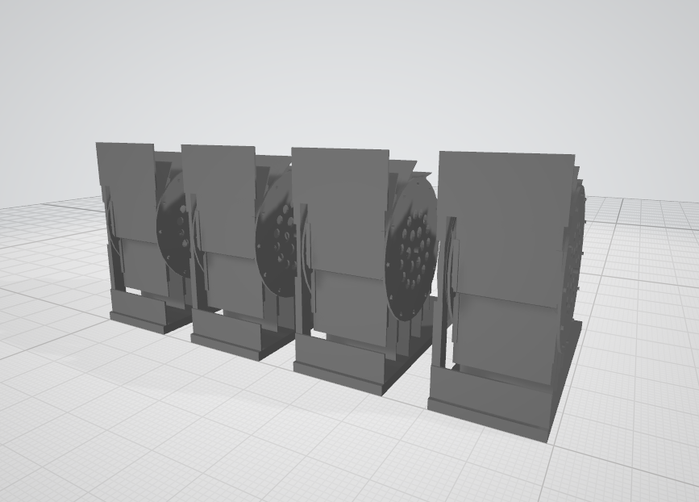
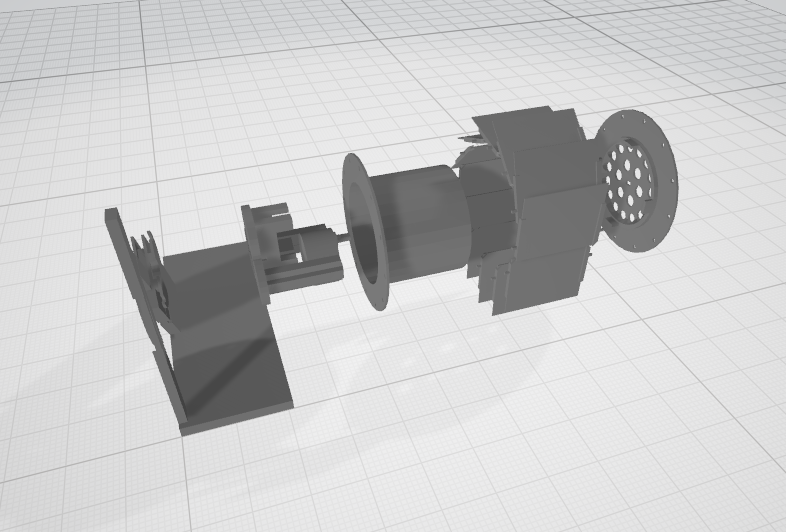

# Flip flap Display

*Patrice Freydiere - Avril 2019*

This repository contains the technical elements to create a flip flap display module, This display can be used for a physical web counter, a clock, letter display.

This is inspired from  [Dead_simple_split_flap_display_ 's work](https://www.thingiverse.com/thing:2369832)

And [splitflap](https://github.com/scottbez1/splitflap) work (upon the buiding simplification)

### Key Design Concept

The FlipFlap module aim to reduce the number of part to build it. Modules are connected to each others and contribute to display large messages. The module is only responsible to manage the mechanics and contribution intelligence.

Using standard PVC card helps have nice diplay digits, they are easy to setup as there are printers allowing to create the fonts.

Using SCAD as modeler permit to have adaptative design, and change the dimensions.

Four Spaces Modules:

 

Exploded view:

This project is still under tests and build stage. All comments, improvements are welcome.

The 3D design aim to be printed, with a minimum parts number. 

for more informations, go to **doc/** folder on how to print and build

# Project State

#### V1

- [x] 3D Print - V1 
- [x] Electronic Schematic
- [x] Card Mounting
- [x] Software
- [x] Structure for fix

#### V2

3D Design

- [x] Thick enlrge for switch
- [x] Redesign card fixtures
- [x] Support Design, to be simple light and permit to add decorations.
- [ ] Add switch on electronic Card & Pullup

V2.1

- [ ] Testing the Software Serial, apparently an error in choosing the pins 3 is not interrupted changed compatible ->, use 8 or 9