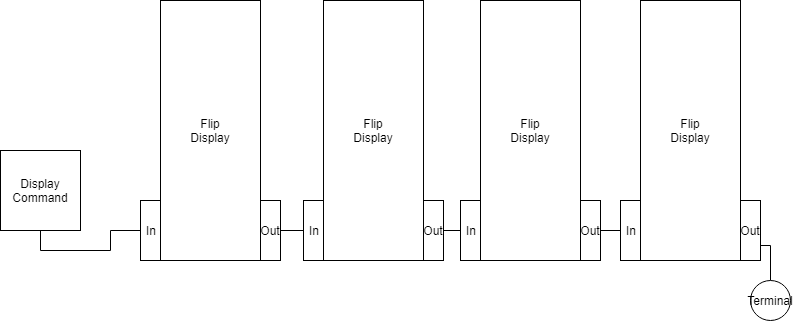
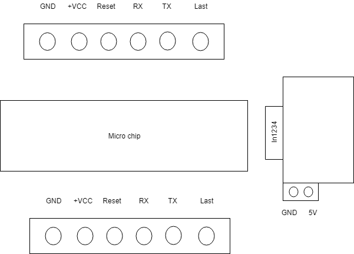
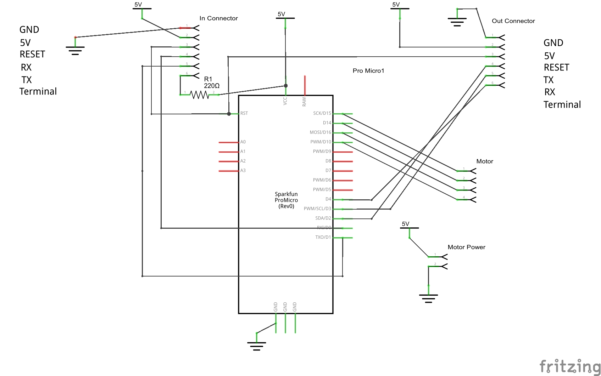

# Electronic Card

*Patrice Freydiere - 2019*

The electronic is module specific, but can be connected with others modules to create a variable length number.

Every modules have a in-connector and out-connector. They transmit information upward and backward using a serial communication.

Inside the module, the main controller, is connected to the stepper motor driver, and the out-connector.

Basic schema of the electronic elements associated to modules :

## Electronic Schema

The schema is as follow :

### Connector pins

Slot from the input side

<-  on the input side

- GND
- VCC
- RESET
- RX
- TX
- pull up connection

On the other side / symetric

- GND
- VCC
- RESET
- TX
- RX
- Connected

### The electronic software logic:

To have more information about the control of the digit using the serial port, see 

