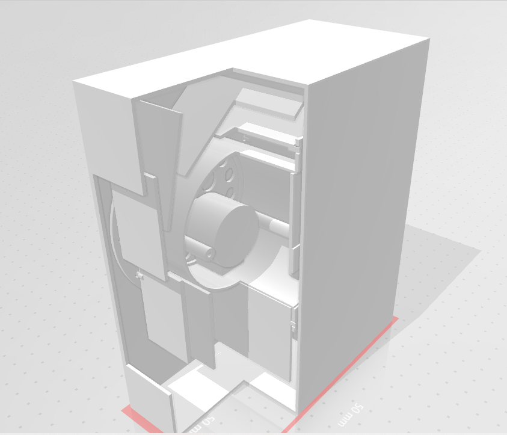

# Flip Flap - Digit - module (FLIP-1)

This module display a digit, using an energy minimum approach

## Feature

- Affordable

- easy to create and mount
- Adaptative

## Dimensions

## Components

| Reference        | Qty  | Description                    |      |
| ---------------- | ---- | ------------------------------ | ---- |
| FLIP-1-3D1       | 1    | Stator                         |      |
| FLIP-1-3D2       | 1    | Rotor - 1                      |      |
| FLIP-1-3D3       | 1    | Rotor - 2                      |      |
| FLIP-1-CARDS     | 12   |                                |      |
| FLIP-1-MOTOR_CMD | 1    | 28byj-48 - module with command |      |

## 3D model

