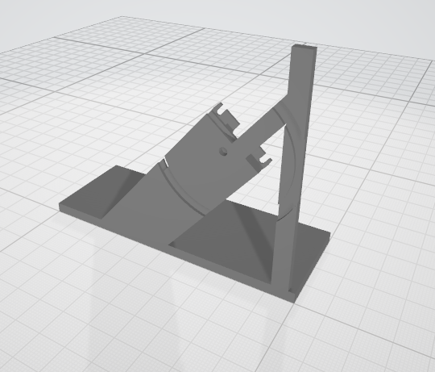
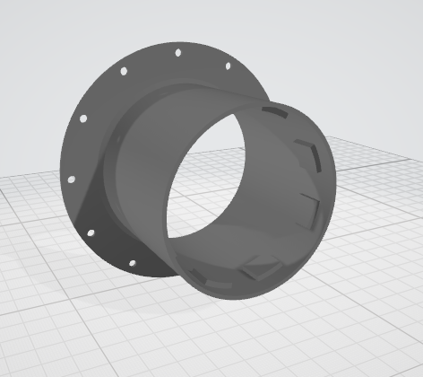
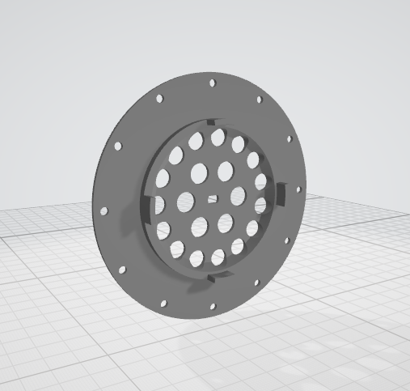
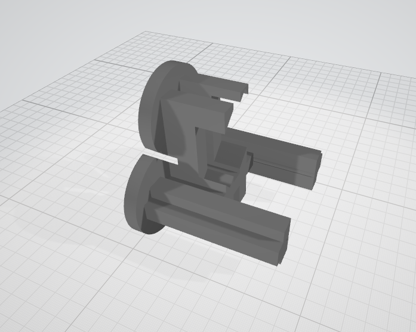
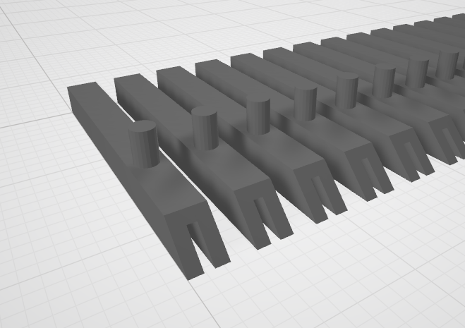
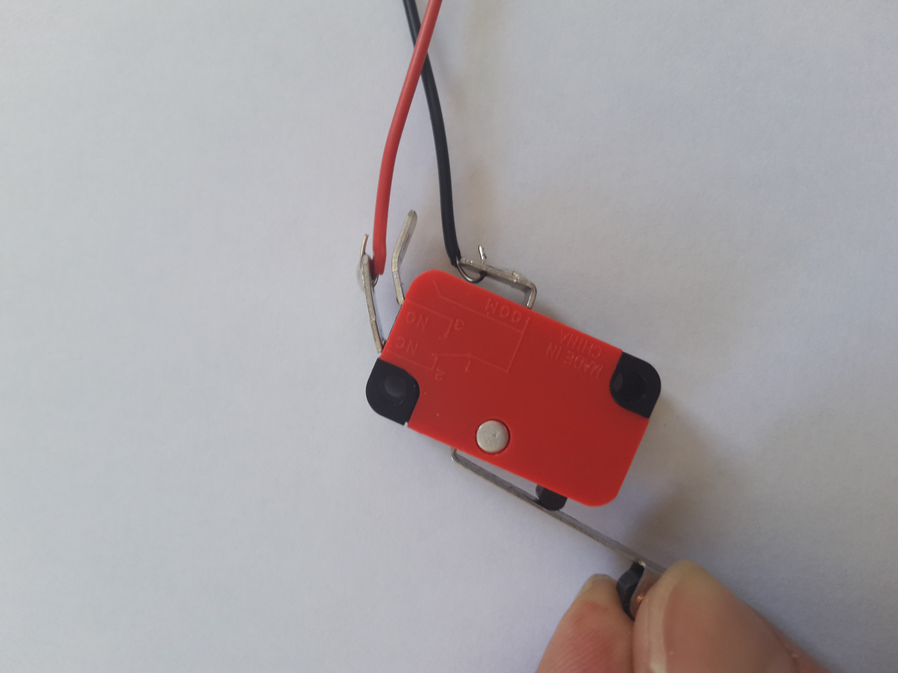
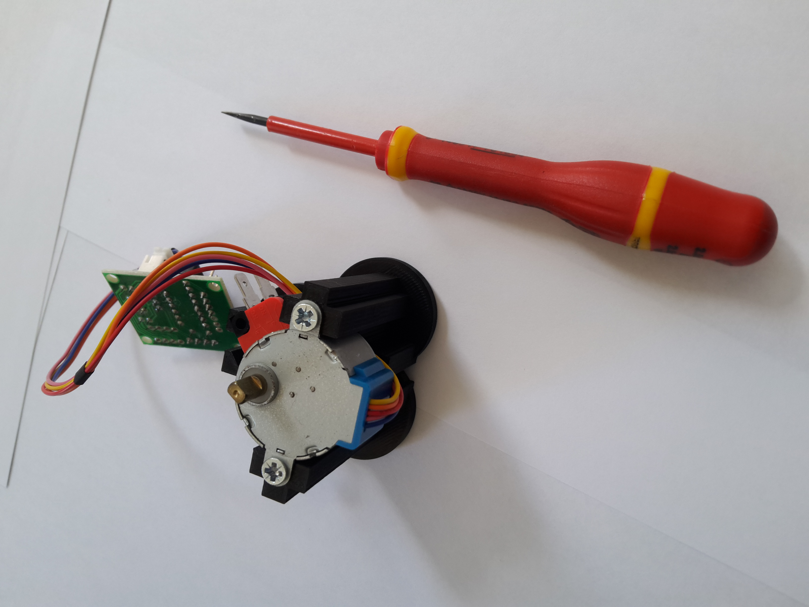
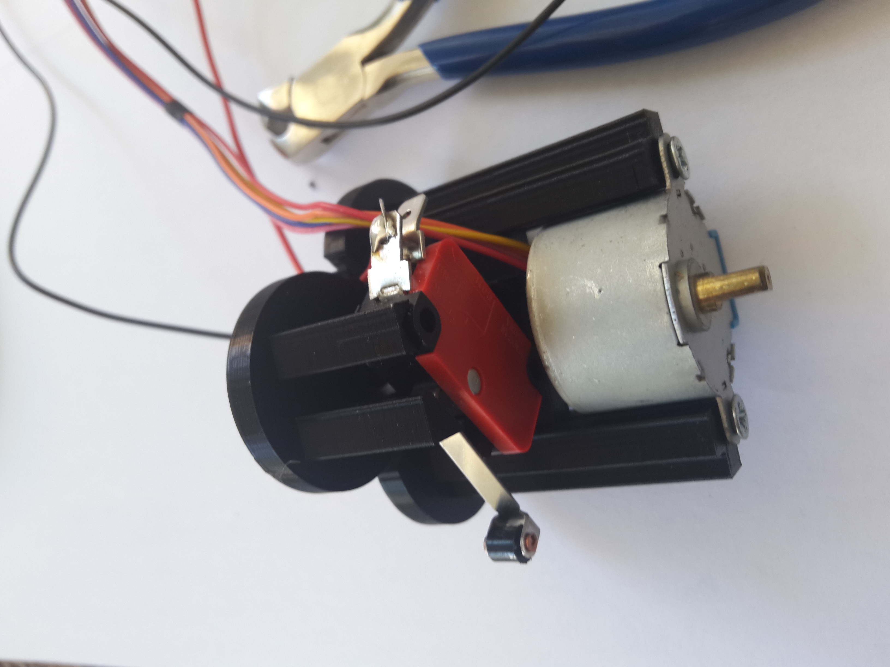
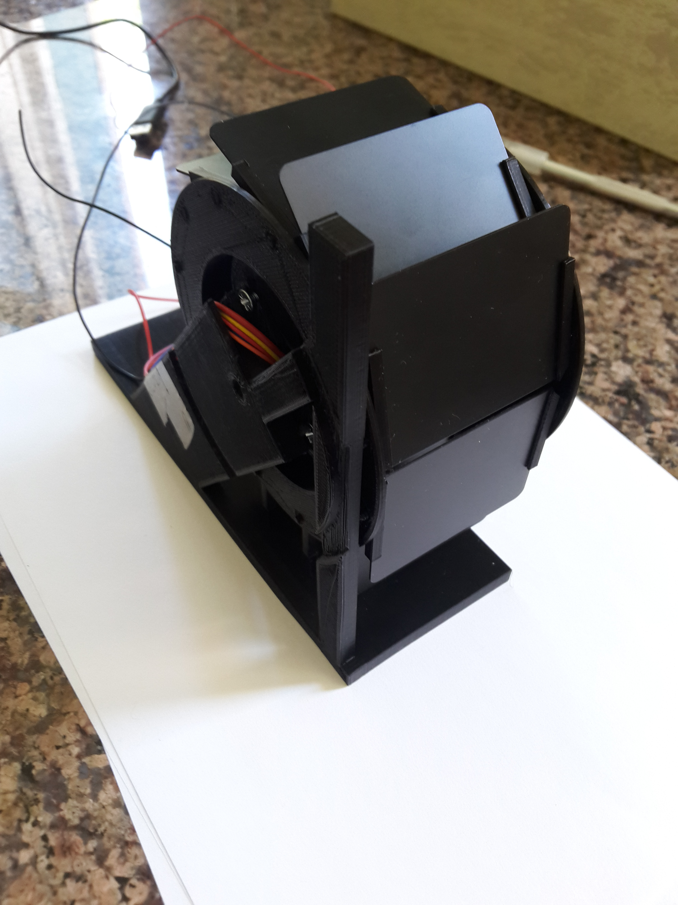

# Flip Flap - Digit - module (FLIP-1)

*Patrice Freydiere - 2019-04*

This module display a digit, using an energy minimum approach. 

## Feature

- Affordable

- easy to create and mount
- Adaptative

## Dimensions

The module has the following dimensions currently, using a PVC card as reference for the digits.

 "depth=", 109.55, "width=", 59.98, "height=", 152.2

## Components

| Reference        | Qty  | Description                                 | Cost Home Made (€) | Cost Parts         |
| ---------------- | ---- | ------------------------------------------- | ------------------ | ------------------ |
| FLIP-1-3D1       | 1    | Stator                                      | 2                  | 5€ / per 20 parts  |
| FLIP-1-3D2       | 1    | Rotor - 1                                   | 2                  | 5€ / per 20 parts  |
| FLIP-1-3D3       | 1    | Rotor - 2                                   | 2                  | 5€ / per 20 parts  |
| FLIP-1-3D4       | 1    | Support for sustain the display             | 3                  | 10€ / per 20 parts |
| FLIP-1-CARDS     | 6    | Flip cards (6 * 2) half cards               | 30€ per 500 pieces |                    |
| FLIP-1-MOTOR_CMD | 1    | 28byj-48 - module with command card (LN218) | 4 € each           |                    |
| FLIP-1-SWITCH    | 1    | Homing switch                               | 2 € each           |                    |

<u>Currently in tests:</u>

Vinyl letters :

<https://www.amazon.com/dp/B079HJRG1X/ref=sspa_dk_detail_0?pd_rd_i=B077KDX4NR&th=1>

(2inch)

## 3D model

Model is build with OpenScad, permitting to create parametric models, this is really usefull for optimization and alternatives.

There are 4 parts, 

The support :

The rotor in 2 parts, 

And the stator for the mounting elements :

And for card fix :

## Electronic

Electronic card is composed of a leonardo microchip, this chip handle the motor, homing, and communication. And external USB connected unit gives the numbers to display.

A lonely electronic card is hosted in the display.

## How to mount flip display

Step 1 : solder the switch, 

Mount motor on stator :

Switch soldering

Put the stator into the mounted rotor and fix them on the support using the 2 skrews. Take caution of the cable there is calculated space to not make the cable be damaged.

The mounted result :

