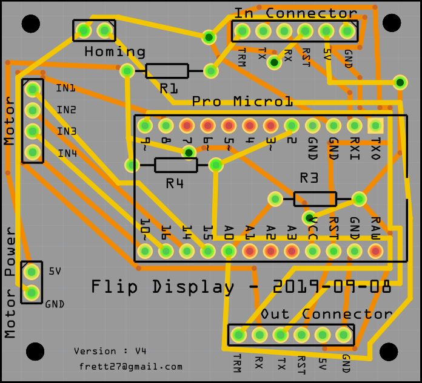

# Flip Flap - Digit - module (FLIP-1)

*Patrice Freydiere - 2019-04*

This module display a digit, using an energy minimum approach. 

## Feature

- Affordable

- easy to create and mount
- Adaptative

## Dimensions

The module has the following dimensions currently, using a PVC card as reference for the digits.

 "depth=", 109.55, "width=", 59.98, "height=", 152.2

## Components

| Reference        | Qty  | Description                                 | Cost |
| ---------------- | ---- | ------------------------------------------- | ---- |
| FLIP-1-3D1       | 1    | Stator                                      | 2    |
| FLIP-1-3D2       | 1    | Rotor - 1                                   | 2    |
| FLIP-1-3D3       | 1    | Rotor - 2                                   | 2    |
| FLIP-1-CARDS     | 6    | Flip cards (6 * 2) half cards               | 10   |
| FLIP-1-MOTOR_CMD | 1    | 28byj-48 - module with command card (LN218) | 4    |

<u>Currently in tests:</u>

Vinyl letters :

<https://www.amazon.com/dp/B079HJRG1X/ref=sspa_dk_detail_0?pd_rd_i=B077KDX4NR&th=1>

(2inch)

## 3D model

Model is build with OpenScad, permitting to create parametric models, this is really usefull for optimization and alternatives.

## Electronic

Electronic card is composed of a leonardo microchip, this chip handle the motor, homing, and communication. And external USB connected unit gives the numbers to display.

a lonely electronic card is hosted in the display.

## How to mount flip display

@@@ TODO